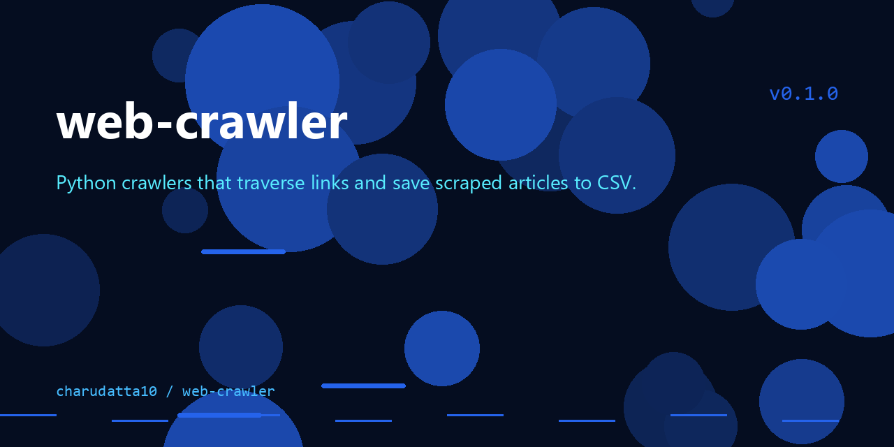

 
# Web-crawler

<p align="center">
  
</p>


<!-- Badges: Project Status GitHub -->


[](https://github.com/sponsors/charudatta10)
[](https://charudatta10.github.io/LinkNet/)
[](https://charudatta10.github.io/Portfolio/)


<!-- Badges: Tools used -->
`python` `just` `gig` `request` `beutifulsoup` 

## What is this? 🗎

Crawlers can validate hyperlinks and HTML code. They can also be used for web scraping. This project provides Python crawlers that start from a seed URL, traverse links up to a configurable depth, and save scraped articles to CSV for offline research and analysis.

## Features 🌟

- Collect data 
- perform research 
 

## Getting Started 🌱

Clone and install dependencies:

```bash
git clone https://github.com/charudatta10/web-crawler.git
cd web-crawler
pip install requests beautifulsoup4
```

Run the crawler:

```bash
invoke run
```

## Usage examples

Run the full crawl pipeline:

```bash
python src/web_crwaler.py
python src/clean.py
```

Scraped articles are saved to `articles.csv` for downstream research.

## License

Distributed under the GNU General Public License v3.0 (GPL-3.0).

✨[Report a 🐛 or Request a ⭐](https://github.com/charudatta10/Web-crawler/issues)✨

Copyright :copyright: 2024 CK :tm: @ charudatta10.   

<!-- Acknowledgment, References, Misc -->